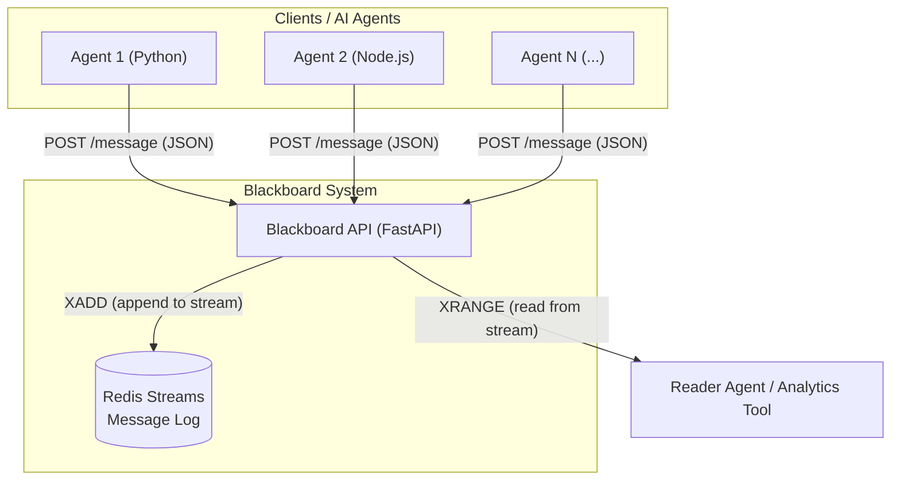

# Blackboard MCP: A Centralized Log for AI Agents

This project provides a centralized "blackboard" system where multiple AI agents can post and retrieve messages. All message activity is durably logged into a Redis database, creating a powerful audit trail for observing, replaying, and analyzing agent behavior.

The core purpose is to serve as the foundational data layer for a **Model Context Protocol**, enabling advanced monitoring and anomaly detection in multi-agent AI systems.

## Core Architecture

The system is designed to be simple, robust, and scalable.



1.  **AI Agents**: Any process that can send an HTTP request. They send structured JSON messages to the central API.
2.  **Blackboard API**: A Python [FastAPI](https://fastapi.tiangolo.com/) server. It exposes endpoints to post messages and read the entire message log. Its only job is to validate incoming data and persist it to the database.
3.  **Redis Streams**: The database. Redis Streams are an append-only data structure, which is perfect for creating an immutable, time-ordered log of everything the agents say or do.

---

## Getting Started: From Zero to Logging

Here is a complete guide to setting up and running the system on your local machine.

### Prerequisites

*   **Python 3.8+**
*   **Docker** and **Docker Compose** (for running the Redis database). Make sure the Docker Desktop application is running.

### 1. Setup

First, set up your Python environment.

```powershell
# Clone the repository (if you haven't already)
# git clone ...

# Create a Python virtual environment
python -m venv .venv

# Activate the virtual environment
# On Windows PowerShell:
.\.venv\Scripts\Activate.ps1
# On macOS/Linux:
# source .venv/bin/activate

# Install the required Python packages
pip install -r requirements.txt
```
*Note: If you get an error running `Activate.ps1` on Windows, you may need to relax your script execution policy for this one time by running: `Set-ExecutionPolicy -ExecutionPolicy RemoteSigned -Scope Process`*

### 2. Run the System

You will need **two separate terminals** for this, both with the virtual environment activated.

**In Terminal 1: Start the Database and API Server**

```powershell
# Start the Redis database in the background using Docker
docker compose up -d redis

# Run the FastAPI server
uvicorn blackboard.main:app --reload
```
You should see output indicating the server is running and waiting for requests on `http://127.0.0.1:8000`.

**In Terminal 2: Interact with the Blackboard**

Now you can act as one or more AI agents.

```powershell
# Post a message from 'analyst-007' for conversation 'conv-alpha'
python agent.py "Starting my analysis." --agent-id analyst-007 --conversation-id conv-alpha

# Post another message in the same conversation
python agent.py "Data looks clean, proceeding with summary." --agent-id analyst-007 --conversation-id conv-alpha

# Read all the messages currently on the blackboard
python reader.py
```

### 3. Inspect the Database Directly

Want to see the raw data exactly as it's stored in Redis? You can connect directly to the database.

**Open a third terminal** (no venv needed for this).

```powershell
# Execute the Redis Command-Line Interface inside the running container
docker compose exec redis redis-cli

# Inside redis-cli, fetch all messages from the stream
XRANGE blackboard_messages - +

# To exit redis-cli when you're done
exit
```
This gives you a ground-truth view of the data, which is invaluable for debugging.

---

## How This Supports Diverse AI Agents

The key is the **structured data model**. By enforcing a consistent JSON structure for every message, we can easily query and analyze the logs, regardless of what language the agent is written in or what its purpose is.

The current message schema includes:
*   `agent_id`: Who sent this message?
*   `conversation_id`: What task or conversation thread does this message belong to?
*   `message_type`: What is the *intent* of this message (e.g., `thought`, `tool_use`, `final_answer`)?
*   `payload`: A flexible `dict` for any other relevant data (the text itself, tool parameters, token counts, confidence scores, etc.).

This allows us to move beyond simple chat logs and start treating the blackboard as a rich, queryable database of agent behavior.

## Next Steps & Vision

This project is the essential foundation. The ultimate goal is to use this logged data for real-time monitoring and analysis. The next steps are:

1.  **Real-Time Subscriptions**: Implement a way for services to listen to messages as they arrive (using WebSockets or Server-Sent Events) instead of having to poll the `/messages` endpoint.
2.  **Build an Anomaly Detector**: Create a separate "listener" service that connects to the blackboard. This service will apply rules to the stream of messages to detect "weird behavior," for example:
    *   An agent using a tool it's never used before.
    *   A conversation taking much longer than average.
    *   An agent expressing low confidence in its own final answer.
3.  **Visualization Dashboard**: Create a simple web interface to visualize the message flow and display alerts from the anomaly detector.
